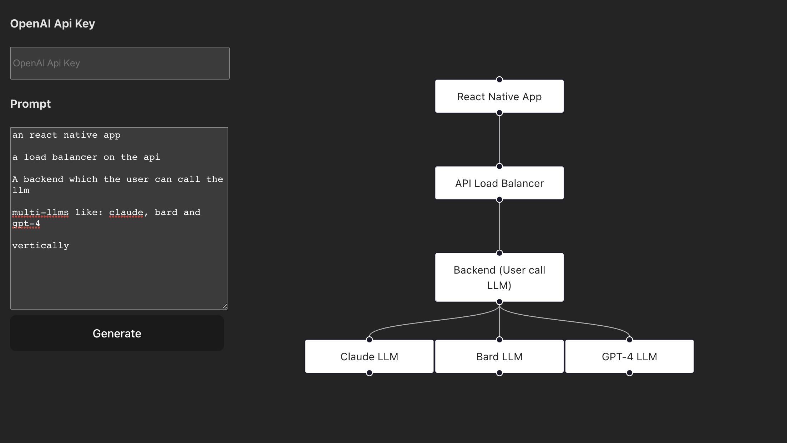

## Welcome to gpt-flow

We're using [React Flow](https://reactflow.dev) + GPT-4 to make this possible, the app offers a user-friendly interface for users to input their ideas, concepts, or data, which is then processed by AI to create visually engaging and informative diagrams.



## Getting Started
To get started with AI Diagrammer, you will need to install the necessary dependencies and run the application locally.

## Prerequisites
- Node.js v14.x.x or higher
- Yarn package manager
## Installation
1.Clone the repository
```bash
git clone https://github.com/EmanuelCampos/gpt-flow.git
```
2.Change directory
```bash
cd gpt-flow
```
3.Install dependencies
```bash
yarn install
```
4.Start the development server
```bash
yarn dev
```
Now, navigate to http://localhost:PORT in your browser to see the application in action!

## Usage
After launching the application, setup your OpenAI API Key and let our AI do the work of creating the diagram for you.

## Contributing
We welcome contributions from the open-source community. If you'd like to contribute, please fork the repository and create a new branch for your features or bug fixes. Once your changes are ready, create a pull request.

## Support
If you encounter any problems or have any suggestions, please open an issue on our GitHub page.